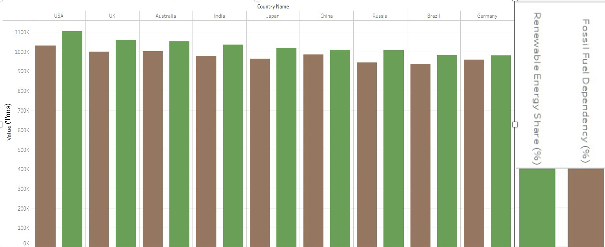
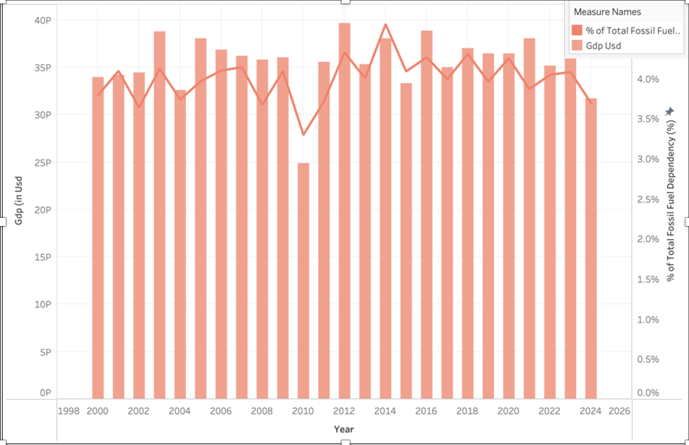
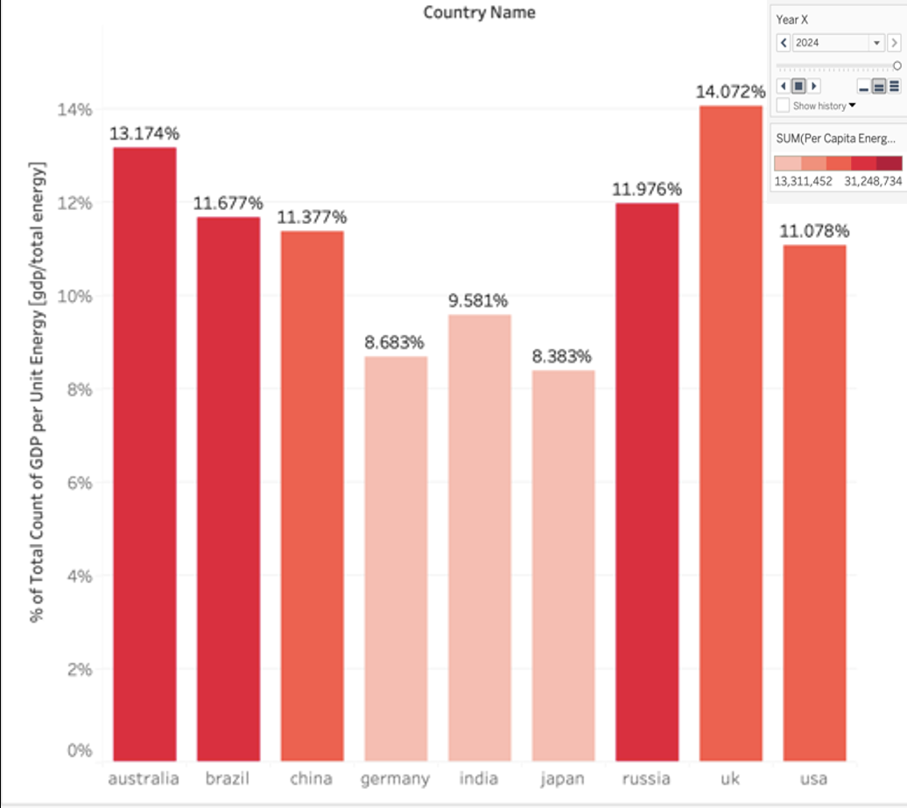
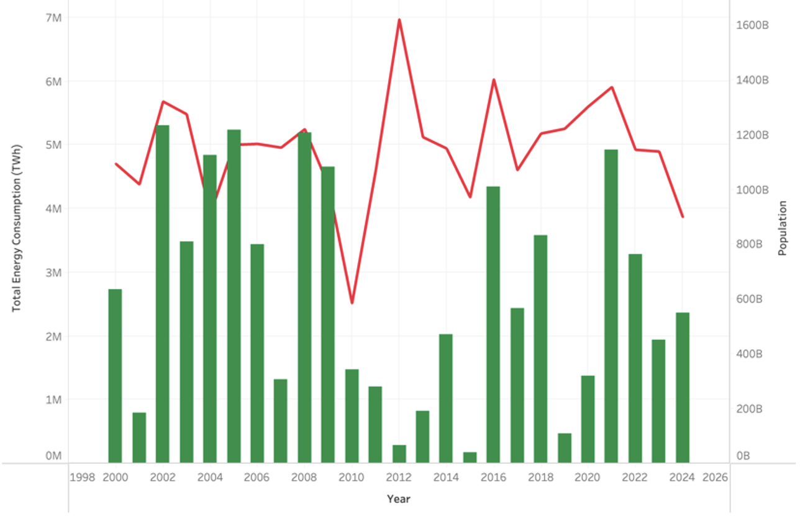
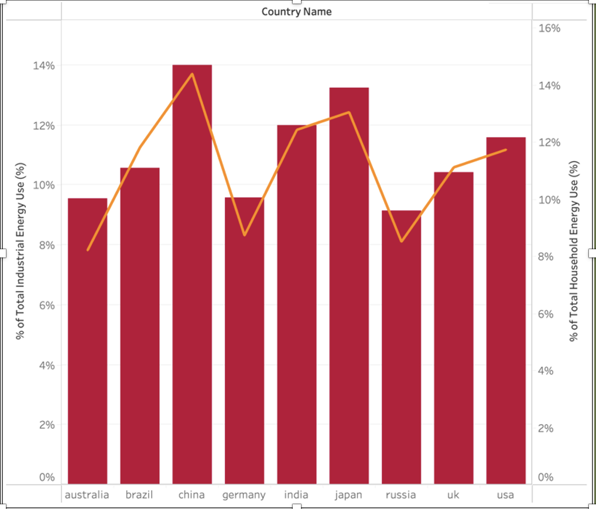

# 🌍 Global Energy Consumption Trends

📊 **Analyzing the interplay between energy consumption, climate impact, and economic growth across countries (2000–2024).**

---

## 🔍 Overview

This project explores global energy consumption patterns and their relationship with carbon emissions, renewable energy adoption, and economic growth across multiple countries.

By integrating energy, climate, and economic datasets, the analysis uncovers key trends in fossil fuel dependency, energy efficiency, and environmental impact. The goal is to provide data-driven insights that support sustainable energy strategies and informed decision-making.

---

## 🎯 Objectives

- Analyze global energy consumption trends from 2000–2024  
- Examine the relationship between energy use, GDP, and carbon emissions  
- Compare renewable energy adoption and fossil fuel dependency  
- Study sector-wise energy consumption (industrial vs household)  
- Identify patterns influencing environmental and economic outcomes  

---

## 📁 Dataset

The project uses four structured datasets available within this repository:

- `global_energy_consumption_2000_2024.csv`  
- `gdp_data_2000_2024.csv`  
- `energy_gdp_merged_2000_2024.csv`  
- `final_energy_dataset_2000_2024.csv`  

These datasets include:

- Total energy consumption  
- Renewable energy share  
- Fossil fuel dependency  
- Carbon emissions  
- GDP and GDP per capita  
- Environmental indicators (temperature, rainfall, sea level, etc.)  

---

## 📊 Key Visualizations

### 🔋 Renewable vs Fossil Fuel Transition
<p align="center">
  
  
  
  
  
  <img src="images/co2_vs_gdp_by_country.png"

---

## 💡 Key Insights

- Fossil fuel dependency remains high despite economic growth  
- Renewable energy adoption is increasing but uneven across countries  
- Industrial energy consumption dominates in developing economies  
- Energy efficiency varies significantly across nations  
- Population growth alone does not drive energy consumption  
- Economic growth is not fully decoupled from carbon emissions  

---

## 🛠️ Tools & Technologies

- Tableau  
- Python (Jupyter Notebook)  
- Pandas & NumPy  
- Data visualization techniques  

---

## 📂 Project Structure

```text
global-energy-consumption-trends/
├── data/
│   ├── global_energy_consumption_2000_2024.csv
│   ├── gdp_data_2000_2024.csv
│   ├── energy_gdp_merged_2000_2024.csv
│   └── final_energy_dataset_2000_2024.csv
│
├── docs/
│   ├── project_presentation.pptx
│   ├── project_report.pdf
│   ├── data_profile.pdf
│   └── project_notes.docx
│
├── images/
│   ├── renewable_vs_fossil_transition.png
│   ├── gdp_vs_fossil_fuel_use.png
│   ├── gdp_per_unit_energy_2024.png
│   ├── population_vs_energy_use_usa.png
│   ├── industrial_vs_household_energy_2016.png
│   └── co2_vs_gdp_by_country.png
│
├── notebooks/
│   └── cav-project-3.ipynb
│
├── tableau/
│   └── global_energy_dashboard.twbx
│
└── README.md
```

---

## 📄 Project Files

- Presentation: `docs/project_presentation.pptx`  
- Report: `docs/project_report.pdf`  
- Data Profile: `docs/data_profile.pdf`  
- Notebook: `notebooks/cav-project-3.ipynb`  
- Tableau Dashboard: `tableau/global_energy_dashboard.twbx`  

---

## 📌 Conclusion

This project highlights the strong connection between energy consumption, environmental impact, and economic growth. While renewable energy adoption is increasing, fossil fuel dependency remains a major challenge.

The findings emphasize the importance of improving energy efficiency, adopting cleaner technologies, and aligning economic growth with sustainability goals.
